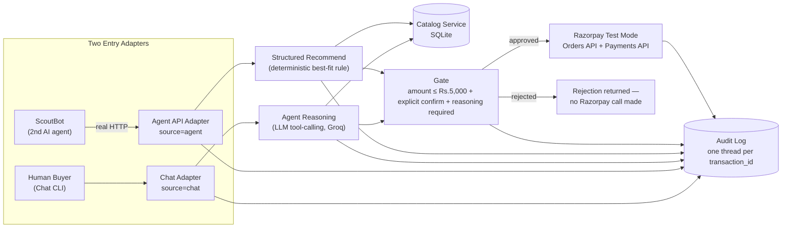

# NEXUS

**Networked Engine for eXplainable, Unified commerce & Settlement**
Razorpay AI Buildathon — Track 01: AI Growth & Agentic Commerce

> A merchant's storefront that both people and AI agents can shop from — safely, explainably, and with proof of every decision it made.

NEXUS is a commerce engine for a fictional camping-gear merchant, **Northlight Outdoors**, built on Razorpay's test-mode APIs. It has two front doors — a human buyer via chat, and an AI buyer agent via a structured HTTP API — sitting on top of one shared core: a Catalog Service, a Gate that bounds and confirms every order before money moves, a full Audit Log, and Razorpay test-mode order creation. Every money action is bounded, explicitly confirmed, and logged, whether it came from a human or from another AI agent.

---

## Architecture



**One divergence from the original brief diagram, flagged for the record:** the brief's diagram shows one "Agent Reasoning" box shared uniformly by both adapters. As built, the **Chat Adapter** uses the LLM tool-calling reasoning core (Groq) to interpret free text and pick products, while the **Agent API Adapter**'s `/recommend` is a small **deterministic** "best fit under budget" rule — no LLM call. The calling agent (ScoutBot) is expected to supply its own reasoning, matching how a real agent-to-agent commerce protocol would work, and avoiding LLM latency/variance on a machine-to-machine path. Everything downstream of that point — **Catalog Service, Gate, Razorpay integration, and Audit Log — is the exact same code for both adapters**, which is the architectural claim that actually matters (see the Gate-bound test in Phase 7/8: both paths reject the identical over-budget case with the identical reason string).

## The 9 build phases

| Phase | What it built |
|---|---|
| 0 — Environment & Access | Razorpay test-mode keys, live Orders/Payments API reachability checks |
| 1 — Catalog Service | 15-product SQLite catalog (Northlight Outdoors), 4 query functions |
| 2 — Agent Reasoning Core | LLM tool-calling (Groq) over the catalog, structured recommend + upsell |
| 3 — The Gate | Amount bound (Rs.5,000), explicit confirmation, reasoning-required checks |
| 4 — Audit Log | One SQLite table, one row per event, threaded by `transaction_id` |
| 5 — Razorpay Integration | Real test-mode order creation, gated — refuses to run without an approved Gate result |
| 6 — Chat Adapter | Two-turn human conversation: recommend → confirm → order |
| 7 — Agent API Adapter + ScoutBot | Documented HTTP API + a second, self-built AI agent calling it over real HTTP |
| 8 — Failure Injection | Amount-bound rejection (both adapters) + simulated Razorpay auth failure, both handled gracefully |
| 9 — Packaging | This README, cleanup pass, demo script |

Full detail on what broke and how it was fixed, phase by phase, is in **[FAILURE_LOG.md](FAILURE_LOG.md)** — including a dedicated "Deliberate Failure Scenarios — Demonstrated" section for the two failure modes proven in Phase 8.

## How to run it

### 1. Environment setup

```bash
python3 -m pip install -r requirements.txt
```

### 2. Configure `.env`

Copy the example file and fill in real credentials — **never commit real keys**, `.env` is already gitignored:

```bash
cp .env.example .env
```

Then edit `.env`:

```
RAZORPAY_KEY_ID=your_key_id_here
RAZORPAY_KEY_SECRET=your_key_secret_here
GROQ_API_KEY=your_groq_api_key_here
```

- Razorpay test-mode keys: [Dashboard → Test Mode → Settings → API Keys](https://dashboard.razorpay.com/)
- Groq API key: [console.groq.com/keys](https://console.groq.com/keys)

### 3. Seed the catalog

The catalog seeds itself automatically (idempotent — safe to call repeatedly) whenever any module that needs it is imported, but you can also do it explicitly and see the data:

```bash
python3 scripts/test_catalog.py
```

This creates `data/nexus.db` (gitignored) with 15 products across 5 categories.

### 4. Run the Chat Adapter (human path)

```bash
python3 scripts/chat_cli.py
```

Type a request, e.g. `I need a good sleeping bag for winter camping, budget around Rs.3000.`, then respond to the confirmation prompt with `yes` or `no`. If an upsell was offered alongside the primary item, the prompt offers a third option — reply `primary only` (or a natural phrase like "just the X") to accept the primary item alone; the Gate is re-checked against that smaller amount before the order is created. Each reply prints its `transaction_id` for later audit lookup.

### 4b. Or use the web Chat UI (same ChatSession, browser instead of terminal)

```bash
uvicorn app.agent_api.main:app --reload
```

Open **http://127.0.0.1:8000/** — a plain HTML/CSS/vanilla-JS chat page served by the same server as the Agent API. It's a thin HTTP wrapper (`POST /chat/start`, `POST /chat/message`, `GET /chat/history/{session_id}`) around the exact same `ChatSession` class `chat_cli.py` uses — no gate/order/audit logic is reimplemented. Sessions persist server-side (in-memory) and the browser keeps its `session_id` in a cookie, so a page refresh resumes the same conversation. Events are still tagged `source="chat"` in the Audit Log, identically to the CLI path.

### 4c. Or use the React frontend (the primary demo UI) — two terminals

This is a genuinely separate frontend application (`frontend/`, React + Vite) — not served by FastAPI, its own dev server, its own origin, talking to the same backend over CORS. It replaces `app/web_chat/static/` as the app we actually demo; the old static UI stays in place and keeps working (Step 4b above) but isn't the primary one anymore.

**Terminal 1 — backend (port 8000):**

```bash
uvicorn app.agent_api.main:app --reload
```

**Terminal 2 — frontend (port 5173):**

```bash
cd frontend
npm install    # first time only
npm run dev
```

Open **http://localhost:5173/**. Same Chat and Catalog views as the static UI, rebuilt as React components (`react-router-dom` client-side routing between `/` and `/products`), same dark theme, same cookie-based `session_id` persistence. The backend's CORS is configured for exactly this origin (`http://localhost:5173`); no other change to the API.

One addition only available here: when the chat classifier detects **browse intent** (e.g. "show me the products you own, lemme browse" — not a specific product ask, not a greeting), the reply includes a real **"Browse Catalog →"** button that navigates to the Catalog view in-app, instead of just describing the catalog in text.

### 5. Run the Agent API + ScoutBot (AI agent path)

Start the API:

```bash
uvicorn app.agent_api.main:app --reload
```

Browse the interactive OpenAPI docs at **http://127.0.0.1:8000/docs**.

In a second terminal, run ScoutBot against it:

```bash
python3 scoutbot/scoutbot.py "Buy one tent under Rs.5000 from Northlight Outdoors"
```

ScoutBot prints its own parsing, catalog browse, product pick, and order result live.

### 6. View the audit trail for a transaction

Every run (chat or agent) prints its `transaction_id`. Look up the full trail at any time:

```bash
python3 scripts/view_audit_trail.py <transaction_id>
```

### Test scripts (one per phase)

```bash
python3 scripts/test_catalog.py
python3 scripts/test_reasoning.py
python3 scripts/test_gate.py
python3 scripts/test_audit.py
python3 scripts/test_razorpay_integration.py
python3 scripts/test_chat_adapter.py
python3 scripts/test_agent_api_scoutbot.py
python3 scripts/test_failure_injection.py
python3 scripts/test_web_chat.py
python3 scripts/test_quantity_handling.py
python3 scripts/test_upsell_decline.py
```

## Project structure

```
app/
  catalog/           Phase 1 — product schema, SQLite, query functions
  reasoning/          Phase 2 — LLM tool-calling reasoning core (Groq)
  gate/               Phase 3 — amount/confirmation/reasoning checks
  audit/              Phase 4 — audit_log table, log_event(), get_transaction_trail()
  razorpay_integration/  Phase 5 — gated Razorpay order creation + payment status
  chat_adapter/       Phase 6 — two-turn human conversation adapter (ChatSession)
  agent_api/          Phase 7 — FastAPI structured endpoint for machine callers
  web_chat/           HTTP routes (chat, catalog listing) + old static UI, wraps ChatSession unmodified
scoutbot/             Phase 7 — the second, self-built AI buyer agent
scripts/              CLI entry points + one test script per phase
frontend/             React + Vite app (primary demo UI) — separate origin, calls the backend over CORS
FAILURE_LOG.md        What broke during this build and how it was resolved
DEMO_SCRIPT.md         Run sheet for the 5-minute pitch video
```
